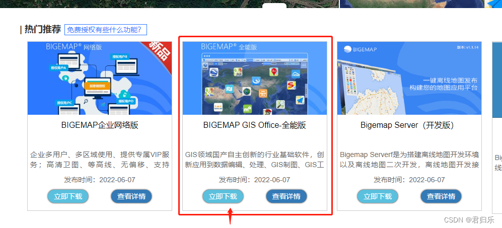
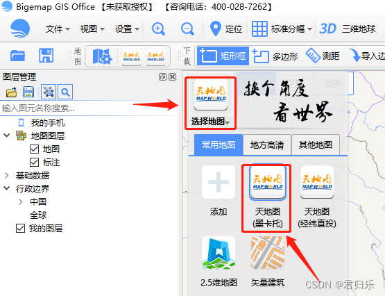
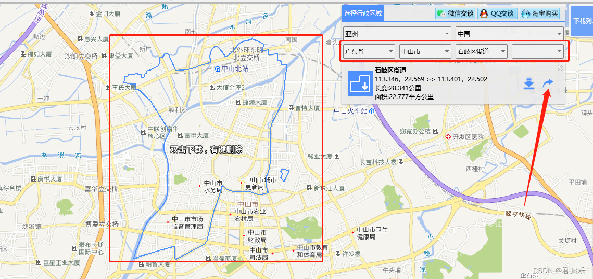
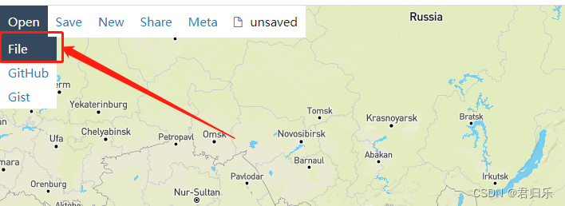
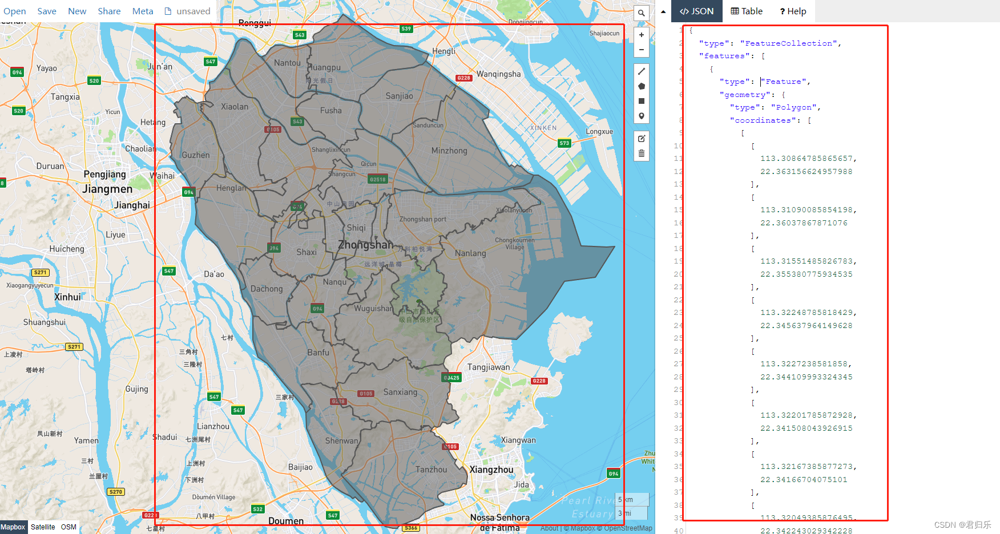

<!--
 * @Author: 何 海深 813936564@qq.com
 * @Date: 2022-09-22 19:42:29
 * @LastEditors: 何 海深 813936564@qq.com
 * @LastEditTime: 2022-09-22 19:49:15
 * @FilePath: \datashowapicturee:\何海深学习发送文件\地图json街道数据生成\使用生成json.md
 * @Description: 这是默认设置,请设置`customMade`, 打开koroFileHeader查看配置 进行设置: https://github.com/OBKoro1/koro1FileHeader/wiki/%E9%85%8D%E7%BD%AE
-->
参考地址：https://blog.csdn.net/weixin_41891519/article/details/125181489
一、需求
1、在echarts上绘制市级以下的区、县的区域地图。
2、在市级下很多都是有区、县的区域，而少部分是不存在区、县的，是直接市下面一级就是街道、镇级别的区域。
3、统一管理区域数据，有区县的市直接拿区县的geoJson数据，没有区县的市级直接拿街道、镇级的geoJson数据来绘制区域地图。
二、获取geoJson数据
注意：以下方法获取的都是2015年左右的数据。

第一种方法（不可获取街道、镇级数据）
阿里云数据可视化平台
http://datav.aliyun.com/portal/school/atlas/area_selector

可以直接获取全国、各省、各市以及个县级市详细地图信息的geoJson数据
注意：目前平台还拿不到街道、镇的区域数据。

================================================================

第二种方法（可获取街道、镇级数据）
第一步（下载kml文件）
BIGEMAP
http://www.bigemap.com/reader/download/

下载完后打开，选择地图

这里以“广东省-中山市-石岐区街道”为例子
可以看出蓝色的区域范围会自动围起区域来

右边红色箭头可以下载街道区域的kml文件下来保存到本地

=======================================================

第二步（导入kml文件获取geoJson）
geojson.io
http://geojson.io/#map=2/20.0/0.0

导入第一步下载好的kml

导入所有的街道、镇数据的效果
